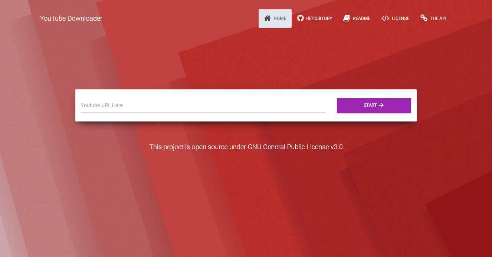
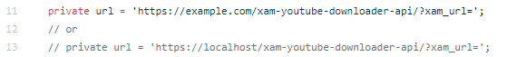

# XAM - Youtube Video Downloader
A simpe and lightweight YouTube video downloader built with Angular and PHP.
> Try it [HERE](https://xamantra.github.io/xam-youtube-downloader)



## Clone the Repository

Clone this repository
```
git clone https://github.com/xamantra/xam-youtube-downloader.git
```

### Prerequisites

1. [nodejs](https://nodejs.org/en/) and [npm](https://www.npmjs.com)
> nodejs already includes npm.

2. Angular CLI
> install via npm
```
npm install @angular/cli
```

3. [xam-youtube-downloader-api](https://github.com/xamantra/xam-youtube-downloader-api). This is written in PHP.

### Setup the PHP api
You need to host this api by using a webserver.
> You can use WAMP for Windows, LAMP for Linux, or MAMP for macOS. But I recommend using XAMPP for all platforms or you can also host it directly to a web hosting site.
Clone this api:
```
git clone https://github.com/xamantra/xam-youtube-downloader-api.git
```
> You can try the DEMO for this api by:
```
https://xamantra.000webhostapp.com/ytd-api/?xam_url=YOUTUBE_VIDEO_URL_HERE
```
> Sample : [https://xamantra.000webhostapp.com/ytd-api/?xam_url=https://www.youtube.com/watch?v=w3jLJU7DT5E](https://xamantra.000webhostapp.com/ytd-api/?xam_url=https://www.youtube.com/watch?v=w3jLJU7DT5E)

[Read](https://github.com/xamantra/xam-youtube-downloader-api/blob/master/README.md) this for more info.


### Setup the Angular app

Once you setup your xam-youtube-downloader-api on a server, your can now setup the xam-youtube-downloader angular project.

1. Open your terminal or any command line tools.
2. Go to xam-youtube-downloader folder.
```
cd xam-youtube-downloader
```
3. Run npm install to install all the dependencies.
```
npm install
```
4. You need to replace this code in 'youtube-response.service.ts' with the appropriate api link that you have setup.
> 
> The app will not work properly if you didn't setup the php api correctly!

## Serving the angular app.

1. Run ng serve to start the app in your browser.
```
ng serve --open
```

The app is now ready for your own modifications.

### Happy Coding!